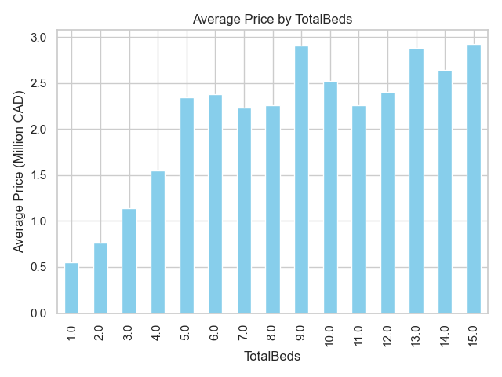
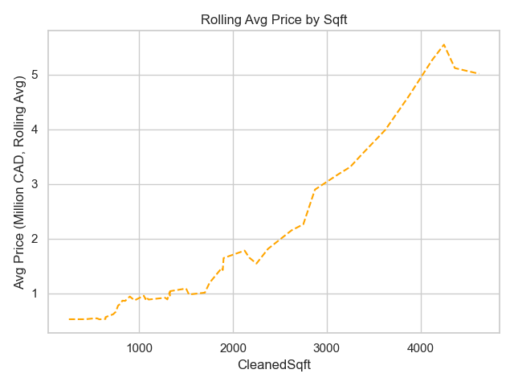
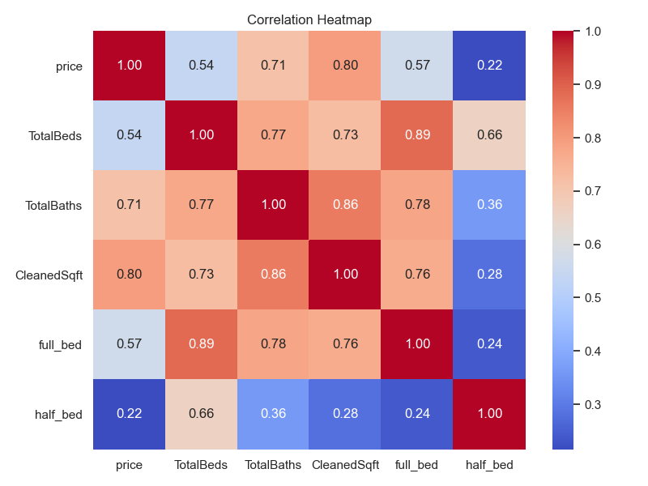
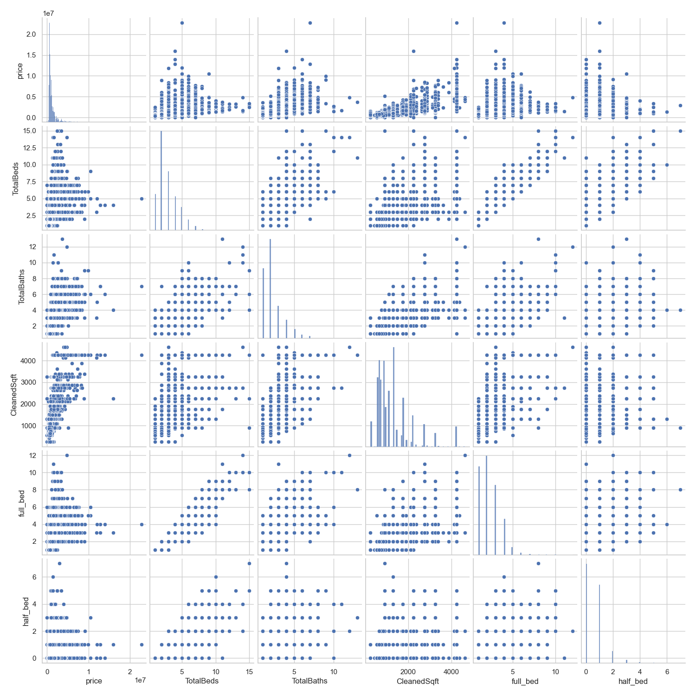

# 🏠 Toronto Housing Price Analysis

This project explores the key factors that influence **residential housing prices in Toronto**, using data **scraped from Zolo.ca** and meticulously cleaned for analysis. The goal is to uncover **trends, patterns, and relationships** between price and features such as **square footage, number of bedrooms, bathrooms**, and more.

Through **exploratory data analysis (EDA)** and visualizations, the project aims to provide **insightful interpretations** of how different housing attributes affect pricing in one of Canada’s most competitive real estate markets.

Tools used include Selenium for web scraping, Pandas for data cleaning and transformation, and Seaborn/Matplotlib for visualization. The project emphasizes **practical data wrangling, visualization, and interpretation skills.**

----

## 📚 Table of Contents
1. [Dataset Description](https://github.com/Ashutosh-Dubal/Toronto-housing-analysis?tab=readme-ov-file#-dataset-description)
2. [Challenges & Learnings](https://github.com/Ashutosh-Dubal/Toronto-housing-analysis?tab=readme-ov-file#-challenges--learnings)
3. [How to Install and Run the Project](https://github.com/Ashutosh-Dubal/Toronto-housing-analysis?tab=readme-ov-file#%EF%B8%8F-how-to-install-and-run-the-project)
4. [How to Use the Project](https://github.com/Ashutosh-Dubal/Toronto-housing-analysis?tab=readme-ov-file#-how-to-use-this-project)
5. [Sample Output](https://github.com/Ashutosh-Dubal/Toronto-housing-analysis?tab=readme-ov-file#-sample-output)
6. [Key Insights & Analysis](https://github.com/Ashutosh-Dubal/Toronto-housing-analysis?tab=readme-ov-file#key-insights--analysis)
7. [Tech Stack](https://github.com/Ashutosh-Dubal/Toronto-housing-analysis?tab=readme-ov-file#-tech-stack)
8. [Project Structure](https://github.com/Ashutosh-Dubal/Toronto-housing-analysis?tab=readme-ov-file#-project-structure)
9. [Author](https://github.com/Ashutosh-Dubal/Toronto-housing-analysis?tab=readme-ov-file#-author)
10. [License](https://github.com/Ashutosh-Dubal/Toronto-housing-analysis?tab=readme-ov-file#-license)

---

## 📦 Dataset Description

The dataset used in this project was **scraped from** [**Zolo.ca**](https://www.zolo.ca/) — a popular Canadian real estate listing platform. It includes detailed information on **residential property listings in Toronto**, captured at a specific point in time.

### ✅ Key Features Collected:

| **Feature**   | **Description**                                                         |
| ------------- | ----------------------------------------------------------------------- |
| Price         | Listing price of the property (in CAD)                                  |
| Location      | Address or neighborhood of the property                                 |
| TotalBeds     | Total number of bedrooms (including main and additional sleeping areas) |
| TotalBaths    | Total number of bathrooms (including full and half baths)               |
| CleanedSqft   | Square footage of the property (converted to a single average value)    |
| BuildingType  | Type of home (e.g., detached, condo, townhouse)                         |
| Storeys       | Number of floors in the property                                        |
| AgeOfBuilding | Approximate age of the property (where available)                       |
|               |                                                                         |
### 🧹 After Cleaning:

- ✅ **Original Entries:** 13,695
- 🧽 **Retained After Cleaning:** 11,832 (≈ 86% retention)
- 🛠️ Cleaned fields include:
    - Consolidation of **bed/bath in “n + m” format**
    - Conversion of **square footage ranges to average values**
    - Removal of **irrelevant or mismatched data (e.g., age values in sqft column)**

---

## 🧠 Challenges & Learnings

### 🕷️ Data Scraping

For this project, I chose to scrape data directly from **Zolo.ca**, a live real estate website, instead of using a pre-existing dataset. My goal was to improve my web scraping skills by working with a real-world site that posed more realistic challenges than static or less protected sources.

- **Strict anti-scraping protections** – Unlike my previous experience scraping IMDb (which was relatively open and straightforward), Zolo employs aggressive anti-bot measures that regularly returned 403 Forbidden errors.

- **Switched to Selenium** – Due to the repeated blocking of tools like requests and BeautifulSoup, I had to shift to **Selenium**. It allowed me to simulate real browser behavior, helping bypass many of the bot detection mechanisms.

- **Dynamic content handling** – Zolo uses JavaScript to load content dynamically, which meant I needed to wait for elements to load and scroll through pages to extract all available data.

- **Data collection logic** – I built logic to loop through multiple pages and extract key fields like price, location, bedrooms, bathrooms, and square footage while handling missing or malformed listings gracefully.

This experience significantly leveled up my scraping skills and gave me hands-on exposure to real-world scraping constraints and workarounds.

### 🧹 Data Cleaning

Cleaning the dataset posed a number of challenges, including mislabeled values, missing data, and inconsistent formats across several key fields. To ensure the data was analysis-ready while maintaining as much of it as possible, I followed a structured approach:

- **Removed irrelevant entries** – For instance, some records had the _age of the building_ mistakenly entered in the sqft column. These were excluded from the dataset.

- **Dropped rows with excessive missing data** – If more than two critical fields (e.g., price, beds, baths, sqft) were missing in a row, that row was removed entirely.

- **Parsed n + m format in bedroom and bathroom data** – Many listings used this format to represent setups like “2+1 beds” (2 bedrooms plus 1 den). I summed these to reflect the total usable rooms.

- **Averaged n - m sqft ranges** – For entries like “1500–2000 sqft”, I took the mean value (e.g., 1750) to represent the property’s approximate size.

- **Data retention** – After cleaning, I retained **11,832 out of 13,695 rows**, which is an **86% retention rate**, comfortably above my target of 75%.

---

## 🛠️ How to Install and Run the Project

Follow these steps to set up and run the Toronto Housing Analysis project:

### 1. Clone the Repository

```bash
git clone https://github.com/Ashutosh-Dubal/Toronto-housing-analysis.git
cd Toronto-housing-analysis
```

### **2.** (Optional) Create a Virtual Environment

```bash
# Create virtual environment (you can name it .venv or anything)
python -m venv .venv

# Activate it
# On macOS/Linux:
source .venv/bin/activate
# On Windows:
.venv\Scripts\activate
```

### 3. Install Dependencies

```bash
pip install -r requirements.txt
```

### 4. Run the Script

a. Scrape data from Zolo (Needs Selenium and ChromeDriver)  

```bash
python scripts/scrape_zolo.py
```

b. Clean the scraped data

```bash
python scripts/clean_data.py
```

This will output a cleaned dataset to: data/clean/toronto_housing_data.csv.

c. Perform exploratory data analysis

```
python scripts/EDA.py
```

---

## 📦 How to Use This Project

Once you've run the full pipeline (`scrape_zolo.py` → `clean_data.py` → `EDA.py`), the project will:

- Generate a cleaned dataset at `data/clean/toronto_housing_data.csv`
- Produce several visualizations (saved or displayed using matplotlib/seaborn)
- Help you analyze housing trends in Toronto based on:
  - Bedrooms, Bathrooms, Square Footage
  - Rolling Averages and Log Transforms
  - Correlation between variables

You can explore or extend the analysis by modifying `EDA.py` to add your own plots or integrate statistical models.

> Note: This project is meant as an **exploratory analysis tool**, not a production-level prediction model.

---

## 📊 Sample Output

### Average Price by no. of Bedroom



This bar chart shows how average home prices change based on the number of bedrooms. Prices generally increase with bedroom count, but fewer data points for homes with more than 6 bedrooms reduce reliability at the high end.

### Rolling Average Price by SQFT



This line plot reveals that housing price increases almost exponentially with square footage. The rolling average removes short-term variability and emphasizes the strong, consistent upward trend.

### Correlation HeatMap



This heatmap quantifies how strongly features like bedrooms, bathrooms, and square footage are correlated with price. Square footage shows the strongest correlation (≈0.80), while bedrooms have a more modest relationship (≈0.54).
### PairPlot of Key Features



A pairwise comparison of the main numerical variables — price, bedrooms, bathrooms, and square footage. The diagonal shows distributions, and off-diagonal plots show potential correlations, such as a clear upward trend between square footage and price.

---
## 👁 Key Insights & Analysis

The journey into Toronto’s housing market revealed several compelling patterns and a few surprises along the way.

One of the **most striking trends** is the strong relationship between square footage and price. As expected, homes with larger living areas tended to command higher prices — and this wasn’t just a linear climb. The pattern resembled **exponential growth**, particularly as properties exceeded 2000 square feet. However, the data also showed that homes with square footage over 3500 were quite rare, and the scarcity of these listings may explain some of the sharp jumps in price.

On the other hand, the relationship between **bedrooms and price** wasn’t as strong as we initially assumed. The correlation coefficient hovered around **0.54**, a moderate value. This made sense upon deeper reflection — a one-bedroom condo downtown can easily outprice a multi-bedroom house in the suburbs. **Location**, rather than just bed count, likely plays a major role here.

**Bathrooms**, interestingly, showed a **higher correlation with price** (**0.71**) than bedrooms did. This might be because additional bathrooms — such as powder rooms or guest baths — often signify higher-end layouts and greater comfort, adding more value per square foot than just another bedroom. Moreover, from a construction standpoint, bathrooms are significantly more expensive to build due to plumbing, fixtures, waterproofing, and finishing requirements. This could help explain why homes with more bathrooms tend to command a higher price — they reflect both greater functionality and higher investment.

Another powerful variable was **CleanedSqft (square footage)**, with a correlation of **0.79** with price — the strongest of all the features examined. When combined with bathrooms (0.86 correlation with sqft), it’s clear that size and comfort together form the foundation of housing prices in Toronto.

From a **distribution standpoint**, most homes were priced in the **$500K–$1M range**, and the market was heavily skewed toward these lower price brackets. This skew impacted certain visualizations, such as boxplots, which became less helpful due to their sensitivity to outliers. Instead, **log transformations and rolling averages** offered better clarity, smoothing extreme values and revealing true trends in the data.

Finally, we found that homes with more than **8 bedrooms or 3500+ sqft** were extremely rare, which suggests a natural ceiling in the residential market — likely driven by both affordability and zoning constraints. Rolling averages made this especially clear by flattening the trend lines at the high end, where data points were too sparse to draw reliable conclusions.

--- 

## 🔧 Tech Stack

- **Python** (Pandas, Seaborn, Matplotlib, NumPy)
- **Web Scraping**: Selenium (Zolo.ca)

---
## 📂 Project Structure

```
toronto-housing-analysis/
├── data/                                       # Raw and cleaned CSV files
│   ├── raw/                                     # Raw scraped data
│   │   └── toronto_raw.csv
│   └── cleaned/                             # Cleaned datasets
│       └── toronto_cleaned.csv
│
├── scripts/                                   # Python scripts for tasks
│   ├── scrape_zolo.py                 # Web scraping logic (Selenium)
│   ├── clean_data.py                   # Cleaning and preprocessing
│   └── EDA.py                               # Exploratory Data Analysis
│
├── utils/                                       # Helper functions if needed
│   └── parsing_helpers.py         # (e.g., price, bed/bath cleaners)
│
├── eda Outputs/
│   ├── sqft range distribution.csv
│   ├── summary stats.json
│   ├── Log price distribution.png
│   ├── price v TotalBeds.png
│   ├── Pairplot of Key Features.png
│   ├── Correlation Heatmap.png
│   ├── Avg price by bedroom.png
│   ├── Avg price by bathroom.png
│   ├── Avg price by sqft.png
│   ├── Rolling avg price by sqft.png
│   ├── Rolling avg price by beds.png
│   └── Rolling avg price by baths.png
├── .gitignore        
├── README.md       
└── requirements.txt               
```

---

## 👨‍💻 Author

Ashutosh Dubal  
🔗 [GitHub Profile](https://github.com/Ashutosh-Dubal)

---

## 📜 License

This project is licensed under the [MIT License](https://opensource.org/licenses/MIT).

